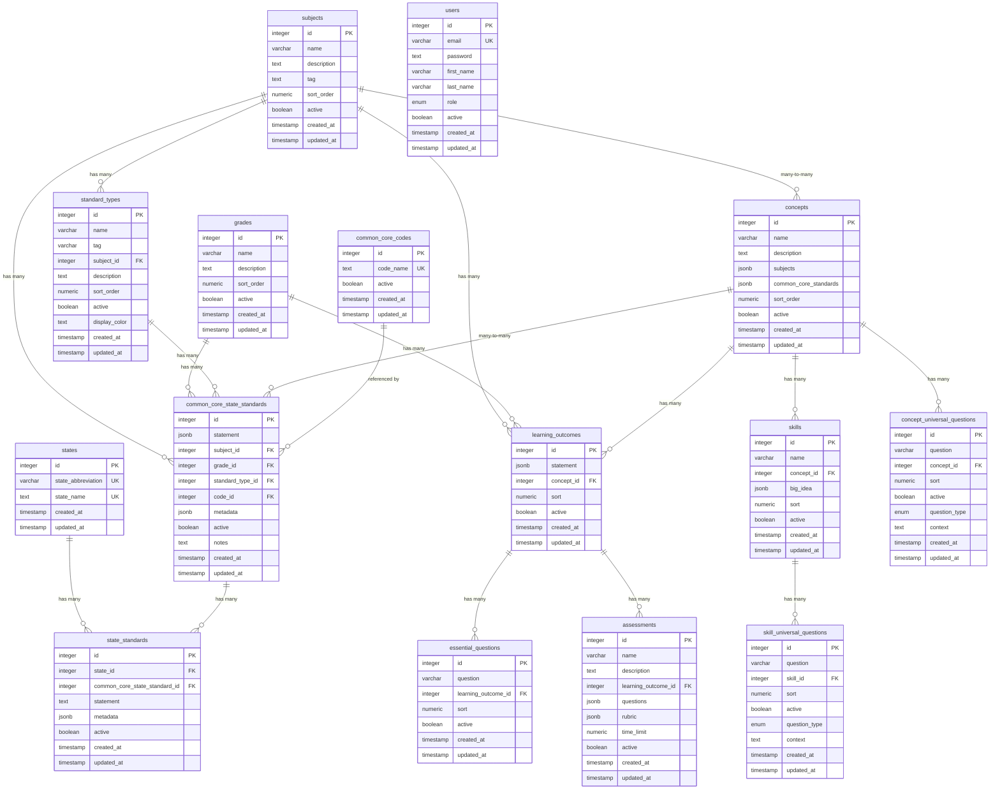

# Curriculum Database Schema - UML Diagram

## Key Features:

### 🎯 **Core Curriculum Structure**

- **Subjects** → **Standard Types** → **Common Core Standards**
- **Concepts** can be linked to multiple subjects and standards
- **Learning Outcomes** tied to specific concepts, subjects, and grades

### 🔗 **Relationship Types**

- **One-to-Many**: Subject → Standard Types, Grade → Learning Outcomes
- **Many-to-Many**: Concepts ↔ Subjects, Concepts ↔ Common Core Standards
- **Referential**: Common Core Codes → Common Core State Standards

### 📊 **Data Flexibility**

- **JSONB fields** for complex relationships (subjects, common_core_standards)
- **Enum fields** for controlled vocabulary (assessment types, difficulty levels)
- **Soft deletion** with `active` boolean flags
- **Audit trails** with `created_at` and `updated_at` timestamps

### 🎨 **UI Support**

- **Display colors** for visual differentiation in the admin interface
- **Sort orders** for consistent content organization
- **Tags** for quick identification and filtering

This schema supports a comprehensive curriculum management system where educators can:

1. **Organize content** by subjects and grade levels
2. **Create learning outcomes** tied to specific concepts
3. **Align with standards** using the Common Core reference system
4. **Build assessments** based on learning outcomes
5. **Manage relationships** flexibly using JSONB fields
